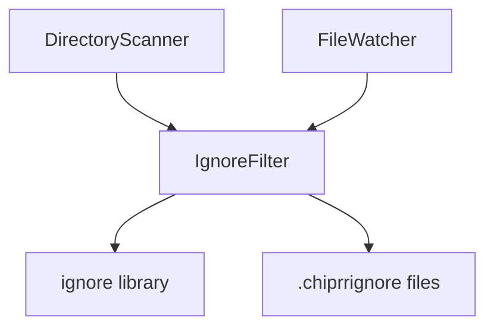

# .chiprrignore Feature Implementation Plan

## Overview

Implement a mechanism to ignore files during directory scanning and file watching using `.chiprrignore` files. The behavior follows gitignore semantics with a special case for empty files.

## Requirements

1. **Empty `.chiprrignore` file**: Ignore all files in the directory and its subdirectories
2. **Non-empty `.chiprrignore` file**: Parse as gitignore format and ignore only matching files
3. **Hierarchical**: `.chiprrignore` files apply to their directory and all subdirectories
4. **Library-based**: Use a well-maintained library for gitignore pattern matching

## Recommended Library

**`ignore`** - npm package for gitignore-style pattern matching

- GitHub: https://github.com/kaelzhang/node-ignore
- Weekly downloads: 50M+
- Fully implements gitignore specification
- Well-maintained and battle-tested
- TypeScript support

### Installation

```bash
bun add ignore
```

## Architecture

### New Components



### IgnoreFilter Service

**Location**: `src/infrastructure/filesystem/IgnoreFilter.ts`

**Responsibilities**:

- Load and parse `.chiprrignore` files from directories
- Cache parsed ignore rules per directory
- Determine if a file path should be ignored
- Handle empty file case - ignore everything

### Interface Design

```typescript
interface IgnoreFilter {
  // Check if a file should be ignored based on .chiprrignore files
  // in its directory hierarchy
  shouldIgnore: function - filePath: string, basePath: string - returns Promise of boolean

  // Clear cached ignore rules - useful for watch mode
  clearCache: function - returns void

  // Preload ignore rules for a directory tree
  loadIgnoreRules: function - directoryPath: string - returns Promise of void
}
```

## Implementation Details

### 1. IgnoreFilter Service

```typescript
// src/infrastructure/filesystem/IgnoreFilter.ts

import ignore, { Ignore } from 'ignore';
import * as fs from 'fs/promises';
import * as path from 'path';
import { Logger } from '../logging/Logger';

const IGNORE_FILENAME = '.chiprrignore';

export class IgnoreFilter {
  private logger: Logger;
  private ignoreCache: Map<string, Ignore | 'ignore-all'>;

  constructor - logger: Logger - {
    this.logger = logger;
    this.ignoreCache = new Map;
  }

  async shouldIgnore - filePath: string, basePath: string - : Promise of boolean {
    const relativePath = path.relative - basePath, filePath -;
    const directories = this.getDirectoryHierarchy - filePath, basePath -;

    for - const dir of directories - {
      const ignoreRules = await this.getIgnoreRules - dir -;

      if - ignoreRules === 'ignore-all' - {
        return true;
      }

      if - ignoreRules && ignoreRules.ignores - relativePath - - {
        return true;
      }
    }

    return false;
  }

  private async getIgnoreRules - directory: string - : Promise of Ignore or 'ignore-all' or null {
    if - this.ignoreCache.has - directory - - {
      return this.ignoreCache.get - directory - ?? null;
    }

    const ignoreFilePath = path.join - directory, IGNORE_FILENAME -;

    try {
      const content = await fs.readFile - ignoreFilePath, 'utf-8' -;

      if - content.trim - - === '' - {
        // Empty file means ignore everything
        this.ignoreCache.set - directory, 'ignore-all' -;
        return 'ignore-all';
      }

      const ig = ignore - -.add - content -;
      this.ignoreCache.set - directory, ig -;
      return ig;
    } catch - error - {
      // No .chiprrignore file in this directory
      this.ignoreCache.set - directory, null -;
      return null;
    }
  }

  private getDirectoryHierarchy - filePath: string, basePath: string - : string[] {
    const directories: string[] = [];
    let currentDir = path.dirname - filePath -;

    while - currentDir.startsWith - basePath - - {
      directories.push - currentDir -;
      const parentDir = path.dirname - currentDir -;
      if - parentDir === currentDir - break; // Reached root
      currentDir = parentDir;
    }

    return directories;
  }

  clearCache - - : void {
    this.ignoreCache.clear - -;
  }
}
```

### 2. DirectoryScanner Modifications

```typescript
// Modified scanDirectory method

private async scanDirectory -
  directoryPath: string,
  files: string[],
  basePath: string,
  ignoreFilter: IgnoreFilter
- : Promise of void {
  try {
    const entries = await fs.readdir - directoryPath, { withFileTypes: true } -;

    for - const entry of entries - {
      const fullPath = path.join - directoryPath, entry.name -;

      // Skip .chiprrignore files themselves
      if - entry.name === '.chiprrignore' - continue;

      // Check if path should be ignored
      if - await ignoreFilter.shouldIgnore - fullPath, basePath - - {
        this.logger.debug - `Ignoring: ${fullPath}` -;
        continue;
      }

      if - entry.isDirectory - - - {
        await this.scanDirectory - fullPath, files, basePath, ignoreFilter -;
      } else if - entry.isFile - - - {
        files.push - fullPath -;
      }
    }
  } catch - error - {
    this.logger.error - `Error reading directory ${directoryPath}: ${error}` -;
    throw error;
  }
}
```

### 3. FileWatcher Modifications

The FileWatcher uses chokidar which has built-in ignore support. We can integrate the IgnoreFilter:

```typescript
// Option 1: Use chokidar's ignored option with a function
this.watcher = watch - this.directoryPath, {
  persistent: true,
  ignoreInitial: true,
  followSymlinks: false,
  ignored: async - filePath: string - => {
    return await this.ignoreFilter.shouldIgnore - filePath, this.directoryPath -;
  }
} -;

// Option 2: Filter in the event handler
this.watcher.on - 'add', async - filePath: string - => {
  if - await this.ignoreFilter.shouldIgnore - filePath, this.directoryPath - - {
    return;
  }
  // ... rest of handler
} -;
```

**Note**: Option 2 is recommended because chokidar's ignored option doesn't support async functions well.

## File Structure After Implementation

```
src/
├── infrastructure/
│   └── filesystem/
│       ├── DirectoryScanner.ts      # Modified
│       ├── FileWatcher.ts           # Modified
│       ├── IgnoreFilter.ts          # New
│       ├── IgnoreFilter.test.ts     # New
│       └── HardLinkCreator.ts
```

## Test Cases

### IgnoreFilter Tests

1. **Empty .chiprrignore file**
   - Should ignore all files in directory
   - Should ignore all files in subdirectories

2. **Pattern matching**
   - Should ignore files matching patterns
   - Should not ignore files not matching patterns
   - Should handle negation patterns - `!important.txt`
   - Should handle directory patterns - `logs/`
   - Should handle glob patterns - `*.log`, `**/*.tmp`

3. **Hierarchical behavior**
   - Parent directory rules apply to children
   - Child directory can have additional rules
   - Most specific rule wins

4. **Edge cases**
   - No .chiprrignore file - nothing ignored
   - Invalid patterns - graceful handling
   - Permission errors - graceful handling

### Example Test Structure

```typescript
describe - 'IgnoreFilter', - - => {
  describe - 'empty .chiprrignore', - - => {
    it - 'should ignore all files in directory', async - - => { ... } -;
    it - 'should ignore all files in subdirectories', async - - => { ... } -;
  } -;

  describe - 'pattern matching', - - => {
    it - 'should ignore files matching glob patterns', async - - => { ... } -;
    it - 'should handle negation patterns', async - - => { ... } -;
    it - 'should handle directory patterns', async - - => { ... } -;
  } -;

  describe - 'hierarchical rules', - - => {
    it - 'should apply parent rules to children', async - - => { ... } -;
    it - 'should combine rules from multiple levels', async - - => { ... } -;
  } -;
} -;
```

## Usage Examples

### Example 1: Ignore Everything in a Directory

```
/media/
├── movies/
│   └── .chiprrignore    # Empty file - ignore all movies
├── series/
│   ├── .chiprrignore    # Contains patterns
│   ├── Breaking Bad/
│   └── Game of Thrones/
```

### Example 2: Ignore Specific Patterns

```
# .chiprrignore in /media/series/

# Ignore sample files
*sample*
*SAMPLE*

# Ignore subtitle files
*.srt
*.sub
*.ass

# Ignore NFO files
*.nfo

# But keep important.nfo
!important.nfo
```

### Example 3: Ignore Specific Directories

```
# .chiprrignore

# Ignore extras folder
extras/
Extras/

# Ignore behind the scenes
behind.the.scenes/
```

## Migration Notes

- No breaking changes to existing functionality
- New dependency: `ignore` package
- Optional feature - works without any .chiprrignore files

## Performance Considerations

1. **Caching**: Ignore rules are cached per directory to avoid repeated file reads
2. **Lazy loading**: Rules are loaded on-demand, not upfront
3. **Watch mode**: Cache can be cleared when .chiprrignore files change

## Future Enhancements

1. **Watch .chiprrignore changes**: Automatically reload rules when .chiprrignore files are modified
2. **Global ignore file**: Support a global .chiprrignore in the root directory
3. **CLI flag**: `--no-ignore` to disable ignore processing
4. **Verbose mode**: Log which files are being ignored and why
